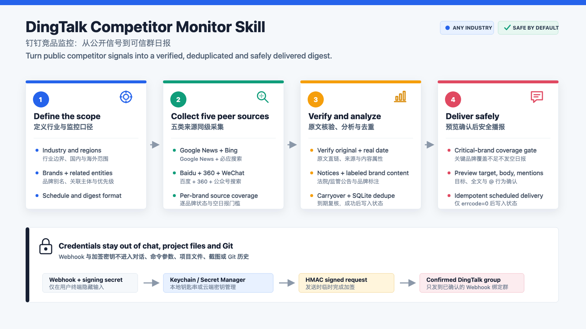

# DingTalk Competitor Monitor

[简体中文](README.zh-CN.md) | English

A reusable Codex Skill that guides a user from industry scoping to a verified, deduplicated competitor digest delivered to a DingTalk group. It generates a complete local Python project instead of returning disconnected code snippets.



## What it does

- Defines the industry boundary, regions, topics, competitors, aliases and priorities through a guided conversation.
- Monitors domestic and global public signals for any industry, not just a fixed competitor list.
- Uses aggregators only for discovery, then requires the original article or official page to be opened and verified.
- Separates facts from inference and supports both an analysis digest and a concise breaking-news format.
- Prevents repeated delivery with normalized title fingerprints and SQLite state.
- Provides a Chinese terminal wizard for DingTalk Webhook and signing-secret validation.
- Stores local credentials in macOS Keychain and keeps them out of chat, project files, logs and Git.
- Previews the full destination, message and mention behavior before a real test or first digest is sent.
- Creates a Codex Desktop schedule only after both real-message checks have succeeded.

## How it works

| Stage | Outcome |
| --- | --- |
| 1. Scope | Confirm the industry, regions, competitors, aliases, priorities, schedule and digest format. |
| 2. Generate | Create a complete Python project with configuration, collection, analysis, sending and tests. |
| 3. Configure | Validate the DingTalk Webhook and signing secret in a friendly Chinese terminal flow. |
| 4. Verify | Preview and explicitly approve one connection test and one analyzed digest. |
| 5. Automate | Schedule weekday or weekly runs in Codex Desktop, either as drafts or authorized sends. |

## Quick start

### Requirements

- Codex Desktop, Codex CLI or the Codex IDE extension with local Skill support.
- macOS and Python 3.11 or later for the generated project.
- Access to a DingTalk group where you can configure a custom robot.
- Access to this private GitHub repository.

### Install for your user account

Codex loads user Skills from `$HOME/.agents/skills`. Clone this repository into that directory:

```bash
mkdir -p "$HOME/.agents/skills"
git clone https://github.com/sunyagang1217-pixel/dingtalk-competitor-monitor.git \
  "$HOME/.agents/skills/dingtalk-competitor-monitor"
```

Codex detects Skill changes automatically. Restart Codex if the Skill does not appear.

### Start the guided workflow

Invoke the Skill explicitly:

```text
Use $dingtalk-competitor-monitor to help me build a competitor-monitoring
robot for my industry and guide me one step at a time.
```

The Skill will first ask about scope and scheduling. It will show the complete derived specification and wait for confirmation before generating files.

When the generated project is ready, run its Chinese credential wizard in your own terminal:

```bash
./scripts/configure_dingtalk.sh
```

Do not paste the Webhook, access token or signing secret into chat. The wizard hides input, validates common copy mistakes and stores both values in macOS Keychain.

## Generated project

The scaffolded project includes:

| Component | Purpose |
| --- | --- |
| `config/monitoring.json` | Industry scope, competitors, aliases, priorities, regions and schedule. |
| `config/analysis_prompt.md` | Original-source verification and digest-writing rules. |
| `src/competitor_monitor_bot/` | Collection, analysis, DingTalk signing, dispatch and SQLite state. |
| `scripts/configure_dingtalk.sh` | Chinese credential setup and validation wizard. |
| `tests/` | Unit tests for configuration, signing, analysis, collection, dispatch and deduplication. |

Typical no-send commands in a generated project:

```bash
PYTHONPATH=src .venv/bin/python -m competitor_monitor_bot.cli check-config
PYTHONPATH=src .venv/bin/python -m competitor_monitor_bot.cli collect-json \
  --output data/analysis.json
PYTHONPATH=src .venv/bin/python -m competitor_monitor_bot.cli analysis-preview \
  --input data/analysis.json
```

These commands validate configuration or build previews. Real sends remain protected by explicit confirmation in the guided workflow.

## Safety model

| Boundary | Behavior |
| --- | --- |
| Credentials | Never request or store Webhooks, tokens or signing secrets in chat, files, screenshots, logs or Git. |
| Sources | Remove an item when the original source cannot be read, is outside the time window or does not support the claim. |
| Content | Keep verified facts separate from interpretation; label company claims as claims. |
| Sending | Show the bound-group target, full title, full body and mention behavior before a real message. |
| Mentions | Do not mention anyone by default. |
| Deduplication | Record state only after successful delivery; suppress same-day reruns and previously sent articles. |
| Automation | Do not enable unattended sending unless the user explicitly authorizes the confirmed scope and schedule. |

## Repository structure

```text
.
├── SKILL.md                         # Runtime workflow for Codex
├── agents/openai.yaml               # Skill display metadata
├── assets/project-template/         # Generated Python project template
├── references/                      # Conversation, safety and automation rules
├── scripts/scaffold_project.py      # Deterministic project generator
└── docs/skill-overview.png          # Workflow overview used in this README
```

## Development and validation

Run the project-template test suite from the repository root:

```bash
PYTHONPATH=assets/project-template/src python3 -m unittest discover \
  -s assets/project-template/tests -v
```

Also validate the Skill directory with the `quick_validate.py` script bundled with the Codex `skill-creator` Skill after changing `SKILL.md` or `agents/openai.yaml`.

## Official references

- [Build skills for ChatGPT and Codex](https://learn.chatgpt.com/docs/build-skills)
- [DingTalk robot overview](https://open.dingtalk.com/document/orgapp/robot-overview)
- [DingTalk custom robot access](https://open.dingtalk.com/document/robots/custom-robot-access)
